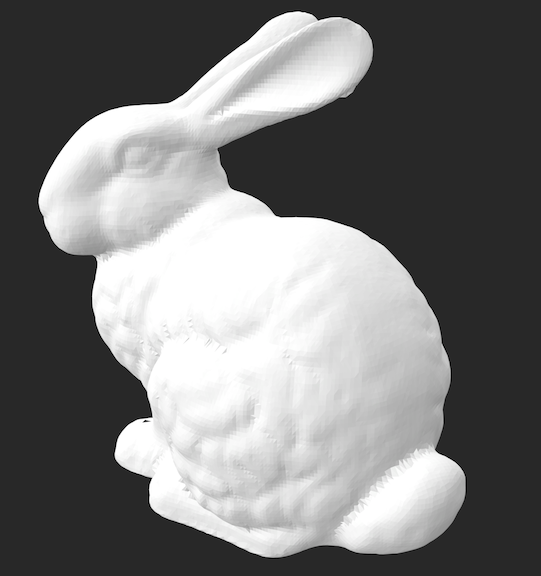

# Ball Pivoting Algorithm

# Overview
The Ball Pivoting Algorithm works by iteratively pivoting a ball of fixed radius along the points of a point cloud. As the ball moves, it seeks to find and connect neighboring points to form triangles, thereby generating a mesh that approximates the surface defined by the point cloud.

<div style="text-align:center;">
    
</div>

# Dependencies
The following dependencies are required to use the Ball Pivoting Algorithm:

- PyGLM: This library provides mathematical operations and structures for computer graphics applications, such as vectors, matrices, and transformations. It is used extensively for geometric calculations within the algorithm.
```bash
# Install PyGLM
pip install PyGLM
```

Ensure that these dependencies are installed in your Python environment before using the Ball Pivoting Algorithm. You can install them via pip, Python's package manager, as demonstrated above.

# Usage
Ensure that you have Python installed on your system and that the required dependencies (`PyGLM`) are installed as described in the "Requirements" section.

1. **Navigate to the src Directory**: 

    ```bash
    cd ball-pivoting-algorithm/src
    ```

2. **Execute the Algorithm**: Run the main Python script with the following command:

    ```bash
    python main.py <input_file> <ball_radius> <output_file>
    ```

    Replace `<input_file>` with the path to your input point cloud file, `<ball_radius>` with the desired radius of the ball used in the algorithm, and `<output_file>` with the desired filename for the resulting surface mesh.

    Example:

    ```bash
    python main.py input_data.xyz 0.1 output_mesh.stl
    ```

3. **View the Output**: Once the program completes execution, you can find the generated surface mesh in the specified output file. To view the resulting surface mesh, you can use an STL viewer application or software of your choice. 
